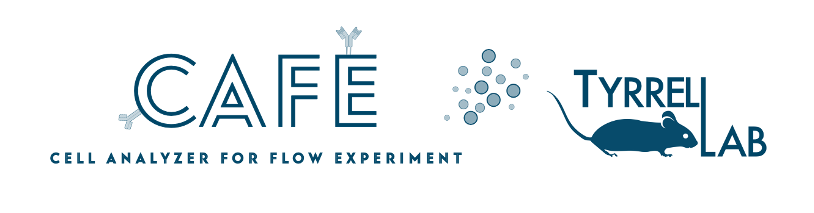

[](https://cafe-tlab.com)




# CAFE (Cell Analyzer for Flow Experiments)

CAFE is an open-source, free, no-code, web-app platform for high-dimensional spectral flow cytometry data analysis. CAFE has been developed in Python and it can run seamlessly on regular computers operating on either Windows, macOS, or Linux. The application will allow the analysis and visualization of SFCM data to produce high-resolution publication-ready figures that support reproducible research of immune cell populations.


##
## How to Download CAFE

### Step 1: Download the tool as a ZIP file
1. Click the **Release** button on the right side of this page.
2. Locate the latest release
3. Select **CAFE_version.zip** file to download.

### Step 2: Extract the ZIP File & Install the tool
1. Right-click the file and choose **Extract All** (or use a file extraction tool to unzip it).
2. After extraction, enter the ./CAFE/ folder. Then, install the tool using either Pixi or Conda.


##
## Installation

### Method 1: Pixi Way

1. **Download the CAFE tool from Github**  
   Then open your terminal and navigate to the folder containing the `cafe.py` file:
   ```bash
   cd ./path/to/cafe
   ```

2. **Install Pixi**  
   Run the following command to install Pixi for Mac/Linux:
   ```bash
   curl -fsSL https://pixi.sh/install.sh | PIXI_VERSION=v0.34.0 bash
   ```
   For Windows:
   ```bash
   iwr -useb https://pixi.sh/install.ps1 | iex
   pixi self-update --version 0.34.0
   ```
   
3. **Install CAFE using Pixi**  
   Type:
   ```bash
   pixi install
   ```

4. **Run the CAFE tool**  
   Run the tool by typing:
   ```bash
   pixi run cafe
   ```


### Method 2: Conda Way

1. **Ensure Anaconda is installed**  
   If you don't have Anaconda installed, download it from [here](https://www.anaconda.com/download/success).

2. **Download the CAFE tool from Github**  
   Then open your terminal and navigate to the folder containing the `cafe.py` file:
   ```bash
   cd ./path/to/cafe
   ```

3. **Create the Conda environment**  
   Run the following command:
   ```bash
   conda env create -f conda.yaml
   ```
   This will create a new environment called `cafe` and install all required packages.

4. **Activate the Conda environment**  
   Type:
   ```bash
   conda activate cafe
   ```

5. **Run the tool**  
   Execute the tool by typing:
   ```bash
   python cafe.py
   ```

   **Note:** If you already have a `cafe` environment from a previous version, remove it first by deactivating the environment and running:
   ```bash
   conda env remove -n cafe -y
   ```
   Then, start from step 3 to set up a fresh environment.
##

## How to Run the App: Step-by-Step Guide

### 01. Preparing the CSV Files

1.1 **Perform manual gating and export scaled CSV files**  
   Export scaled CSV files from FlowJo or similar software. These CSV files will be the input files for the CAFE tool.

1.2 **Rename each CSV file in the following way:**  
   - `SampleID_GroupA.csv` (e.g., `ABC001_Aged.csv`)
   - `SampleID_GroupB.csv` (e.g., `ABC002_Young.csv`)

   **⚡ Pro tip:** For optimal performance, CAFE expects two groups to run properly and perform statistics. Example groups: Aged and Young.

1.3 **Ensure that each CSV file:**
   - Contains the same number of columns (markers).
   - Uses identical marker names across files.
   - Example of consistent markers: CD45, TCRY, CD28, etc.

   **⚡ Pro tip:** CSV files with mismatched column names may result in errors. SampleID should be unique to avoid incorrect results.

**Scaled CSV file structure:**  
Here’s an example of how your CSV file should look like, with marker names as column headers and numerical values representing the expression levels:

| CD27     | CD38     | CD127    | HLA-DR  | CD1c     | CD141    | CD45ra   | CD16     | CCR5     | CD4      | CD11c    | CD56     |
|----------|----------|----------|---------|----------|----------|----------|----------|----------|----------|----------|----------|
| 27257.3 | 5442.59 | 13068.2 | -2432.2 | -3011.07 | 2048.14 | -516.212 | 10914.9 | 4355.31 | 87660.1 | 2256.65 | 1316.62 |
| 16917.6 | 7401.0 | 10038.9 | -1056.87 | -743.682 | -3049.75 | -542.594 | 3165.02 | 4260.19 | 90922.7 | 2309.36 | -686.368 |
| 47378.3 | 4412.47 | 19117.0 | -1147.41 | -654.677 | -5256.23 | 68264.9 | 17845.1 | 8269.94 | 97427.5 | 5624.15 | 2726.43 |
| 1769.79 | 54090.1 | 265.372 | 8136.79 | -2202.24 | 3329.33 | 49450.1 | 3431.71 | 1735.02 | 908.1 | 15106.8 | 6331.52 |
| 40472.1 | 2639.16 | 20865.8 | -2138.81 | -1856.0 | -3293.17 | 81219.1 | 10629.2 | 4249.25 | 91438.0 | 3298.7 | 960.926 |
| 487.425 | 23893.5 | 2089.89 | 6163.82 | 555.821 | 3007.88 | 69839.0 | 7129.61 | 1701.63 | 164.528 | 19372.5 | 9389.31 |
| 31111.4 | 2010.18 | 3647.74 | -1939.37 | 264.905 | 1963.75 | 12751.9 | 8712.62 | 4819.16 | 89793.9 | 5114.97 | 1778.75 |
| -249.461 | 32396.4 | 1188.07 | 18938.1 | 455.37 | -3065.3 | 17207.5 | 1354.81 | 1981.51 | -38.6853 | 9176.99 | 17000.4 |
| 18263.4 | 455.373 | 2590.04 | -1000.35 | -2214.69 | 2975.21 | 421.45 | 5342.13 | 2328.19 | 54503.7 | 2726.56 | 1764.66 |

Data accessible at FlowRepository: FR-FCM-Z3WR

### 02. Running CAFE

```python
# 2.1 Navigate to the tool’s directory
# Tip: Navigate to the directory where your CAFE tool’s Python file (cafe.py) is located.
cd ./path/to/cafe

# 2.2 Run the tool with pixi
pixi run cafe

# or Run the tool with conda
python cafe.py
```
##
## FAQ

**01. Can I load new data without re-running the CAFE app from the beginning?**  
- Absolutely. As mentioned above, you can select **Clear Cache** from the top right setting menu, then either press **Rerun** or simply reload the web page.  
**⚡ Pro Tip:** Clear cache and reload the web page for a quicker restart!

**02. What should I do if I get an error while loading CSV files?**  
- Make sure all CSV files have the same number of markers (i.e., columns) and that the column names match across files.
- Check that your files are named correctly, e.g., `SampleID_GroupA.csv`.

**03. Where are my results saved?**  
- The results are saved in the result directory where the `cafe.py` script was run from.

##
## How to run Data Processing step in HPC?

### Steps:

- Download the standalone script found in CAFE/cafe_hpc.py
- Assign input and output directory
- Assign parameters. Note that some arguments accept multi-parameters such as Leiden resolution
- Run the app

### 1. Choose the Parameters
Decide on the arguments to pass to the script:
- **`--input`**: Path to the input directory containing the CSV files.
- **`--output`**: Path to the output directory where results will be saved.
- **`--pca`**: PCA solver to use (choose from `auto`, `full`, `arpack`, `randomized`, or `none`).
- **`--cutoff`**: Explained variance cutoff for PCA (e.g., 95).
- **`--leiden`**: One or more resolutions for Leiden clustering (e.g., `0.5 1.0 2.0`).
- **`--nneighbor`**: One or more `n_neighbors` values for UMAP and neighbors computation (e.g., `10 20 30`).
- **`--distance`**: Distance metric to use for neighbors computation (default: `euclidean`).
- **`--min_dist`**: `min_dist` parameter for UMAP (default: `0.1`).

### 2. Run the Script
Run the script in your terminal using the following command. For example:
```bash
python3 hpc_run.py \
  --input /path/to/input_dir \
  --output /path/to/output_dir \
  --pca auto \
  --cutoff 95 \
  --leiden 0.5 1.0 \
  --nneighbor 15 30 \
  --distance euclidean \
  --min_dist 0.1
```

## 
## Tool Dependencies

```
python = "==3.12.5"
pip = "*"

#Data processing
numpy = "==1.26.4"
pandas = "==2.2.3"
scipy = "==1.14.1"
pyarrow = "==18.0.0"

#Statistics
statsmodels = "==0.14.4"
scanpy = "==1.10.3"
cliffs-delta = "==1.0.0"

#Visualization
matplotlib = "==3.9.2"
seaborn = "==0.13.2"
plotly = "==5.24.1"
cmasher = "==1.9.0"

#Graph processing
igraph = "==0.10.8"

#Utilities
streamlit = "==1.39.0"
watchdog = "==5.0.2"
kaleido = "==0.2.1"
```
