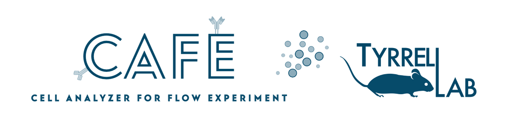
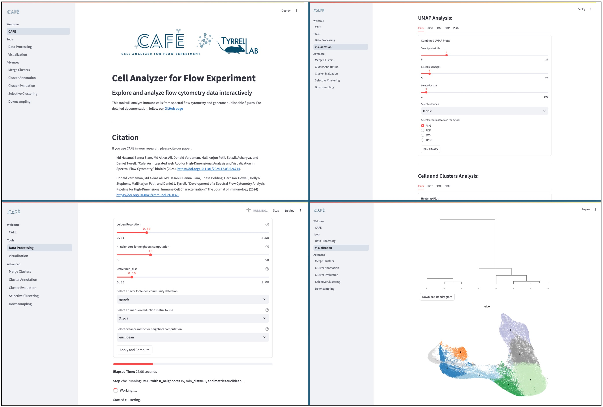
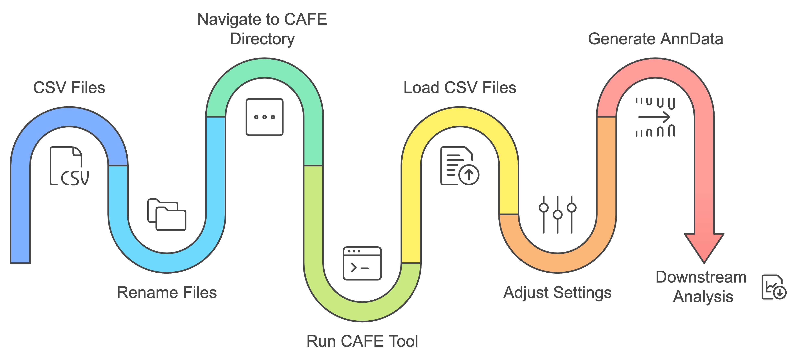

# CAFE (Cell Analyzer for Flow Experiment)

CAFE is an open-source, free, no-code, web-app platform for high-dimensional spectral flow cytometry data (SFCM) analysis. CAFE has been developed in Python and it can run seamlessly on regular computers operating on either Windows or macOS/Linux. The application will allow the analysis and visualization of SFCM data to produce high-resolution publication-ready figures that support reproducible research of immune cell populations.

Example data for testing available at FigShare: 
01. [Downsampled-CSV](https://figshare.com/articles/dataset/Downsampled_data_from_FlowRepository_FR-FCM-Z3WR/27940719)
02. [Processed-H5AD](https://figshare.com/articles/dataset/Downsampled_data_from_FlowRepository_FR-FCM-Z3WR/27940752)

**Update: CAFE is now published in Bioinformatics**

Md Hasanul Banna Siam, Md Akkas Ali, Donald Vardaman, Satwik Acharyya, Mallikarjun Patil, Daniel J Tyrrell, CAFE: An Integrated Web App for High-Dimensional Analysis and Visualization in Spectral Flow Cytometry, Bioinformatics, 2025;, btaf176, https://doi.org/10.1093/bioinformatics/btaf176

##
## Documentation
Click [here](https://mhbsiam.github.io/cafe) to access the guide for installation and running CAFE 


## CAFE Interface



##


##
## Quick Installation and Running CAFE
### Recommended: Install using uv
First, open your Terminal app on Mac/Linux, or Powershell on WIndows:

**1. Install uv:** (skip this step if you already have uv installed)
```bash
# macOS / Linux
curl -LsSf https://astral.sh/uv/install.sh | sh

# Windows (PowerShell)
powershell -ExecutionPolicy ByPass -c "irm https://astral.sh/uv/install.ps1 | iex"
```
Restart your terminal afterwards so that `uv` command is found.

**2. Install CAFE directly from GitHub:** (install it directly from the repository):
```bash
uv tool install "git+https://github.com/mhbsiam/cafe"
```

**3. Run CAFE using uv:**
Just open a terminal anywhere and run:

```bash
cafe
```
This should automatically open the CAFE tool in a web browser. The initial setup of the tool may take longer on your first use.

**4. If a newer version exists, updating CAFE to a newer version:**
```bash
uv tool install --force "git+https://github.com/mhbsiam/cafe"
```
**5. To uninstall CAFE:**
```bash
uv tool uninstall cafe-app
```

##
## Alternative Installation Processes:
## Manually Download CAFE from GitHub

### Download the tool as a ZIP file
1. Click the [Releases](https://github.com/mhbsiam/cafe/releases) button on the right side of this page.
2. Locate the latest release
3. Select **CAFE_version.zip** file to download.

### Extract the ZIP File & Install the tool
1. Extract the files
2. Navigate to the " ./CAFE " folder path where you will find the following files: cafe.py, pixi.toml, cafe.yaml etc.
3. Then, follow the instructions below to run the tool using Pixi or Conda.
   
## Install and run using Pixi

Pixi creates an isolated environment with the right Python (3.12) and every
dependency for you.

**For Mac/Linux**  
Run the following command to install Pixi for Mac/Linux:
```bash
curl -fsSL https://pixi.sh/install.sh | PIXI_VERSION=v0.72.0 bash
```
**For Windows**,  
(1) first run the following code:
```bash
iwr -useb https://pixi.sh/install.ps1 | iex
```
(2) Then run the code below to restore Pixi to a specific version:
```bash
pixi self-update --version 0.72.0
```
After installation using **Pixi**, run it from the CAFE folder:

```bash
# Navigate to the directory containing pixi.toml
cd ./path/to/cafe

# Run the tool with pixi
pixi run cafe
```

## Or, Install using Conda

Conda also builds an isolated environment with the correct Python (3.12) from
`cafe.yaml`. From the extracted `./CAFE` folder (the one containing `cafe.yaml`):
```bash
conda env create -f cafe.yaml
conda activate cafe
```

> Already have a `cafe` environment from an older version? Remove it first with
> `conda env remove -n cafe -y`, then recreate it.

After installing with **Conda**, activate the environment and run the script:

```bash
# Navigate to the directory containing cafe.py
cd ./path/to/cafe

conda activate cafe
python cafe.py
```


##
## Workflow



## Known Issues

Windows OS has known issues with Scanpy and thus generates a higher number of clusters with a given Leiden resolution value. A numpy conflict may provide a value error message, ignore the warning. For optimal performance, consider using WSL to download the CAFE folder from Github using git clone and run the app using Pixi.
```bash
git clone https://github.com/mhbsiam/cafe.git
```
[Here](https://learn.microsoft.com/en-us/windows/wsl/install) is a tutorial on how to install and activate WSL on a Windows computer.
Finally, while reporting data generated using CAFE, mentioning the operating system used for data generation is highly recommended for replicability. 

## Acknowledgement

Original codes were refactored using Devin CLI and Claude Code. New design aesthetics were implemented following 'impeccable' design.

## Citation

If you use CAFE in your research, please cite our paper:

Md Hasanul Banna Siam, Md Akkas Ali, Donald Vardaman, Satwik Acharyya, Mallikarjun Patil, Daniel J Tyrrell, CAFE: An Integrated Web App for High-Dimensional Analysis and Visualization in Spectral Flow Cytometry, Bioinformatics, 2025;, btaf176, https://doi.org/10.1093/bioinformatics/btaf176

Donald Vardaman, Md Akkas Ali, Md Hasanul Banna Siam, Chase Bolding, Harrison Tidwell, Holly R. Stephens, Mallikarjun Patil, and Daniel J. Tyrrell. "Development of a Spectral Flow Cytometry Analysis Pipeline for High-Dimensional Immune Cell Characterization." The Journal of Immunology (2024). [https://doi.org/10.4049/jimmunol.2400370](https://doi.org/10.4049/jimmunol.2400370).
