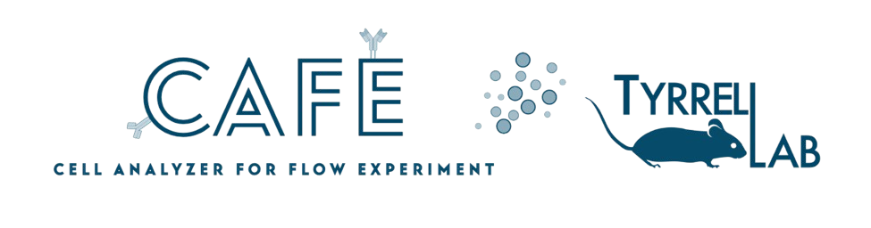

import {Aside} from '@astrojs/starlight/components';

CAFE is an open-source, free, no-code, web-app platform for high-dimensional spectral flow cytometry data (SFCM) analysis. CAFE has been developed in Python and it can run seamlessly on regular computers operating on either Windows or macOS/Linux. The application will allow the analysis and visualization of SFCM data to produce high-resolution publication-ready figures that support reproducible research of immune cell populations.
<Aside type="note" title="Update">
  CAFE is published in Bioinformatics

  Md Hasanul Banna Siam, Md Akkas Ali, Donald Vardaman, Satwik Acharyya, Mallikarjun Patil, Daniel J Tyrrell, CAFE: An Integrated Web App for High-Dimensional Analysis and Visualization in Spectral Flow Cytometry, Bioinformatics, 2025;, btaf176,

 <a href="https://doi.org/10.1093/bioinformatics/btaf176">[DOI: 10.1093/bioinformatics/btad569]</a>.
</Aside>
