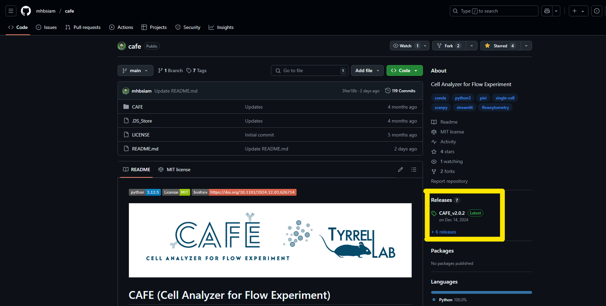

### Step-1: Download the tool as a ZIP file
1. Click the 'Releases' section on Github (or click on this [embedded hyperlink](https://github.com/mhbsiam/cafe/releases))
2. Locate the latest release
3. Select **CAFE_version.zip** file to download.

### Step-2: Extract the ZIP File & Install the tool
1. Extract the files
2. Navigate to the " ./CAFE " folder path where you will find the following files: cafe.py, pixi.toml, cafe.yaml etc.
3. Then, follow the instructions below to run the tool using Pixi or Conda.

